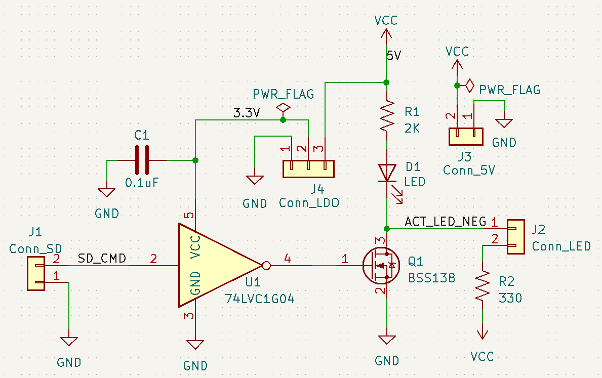
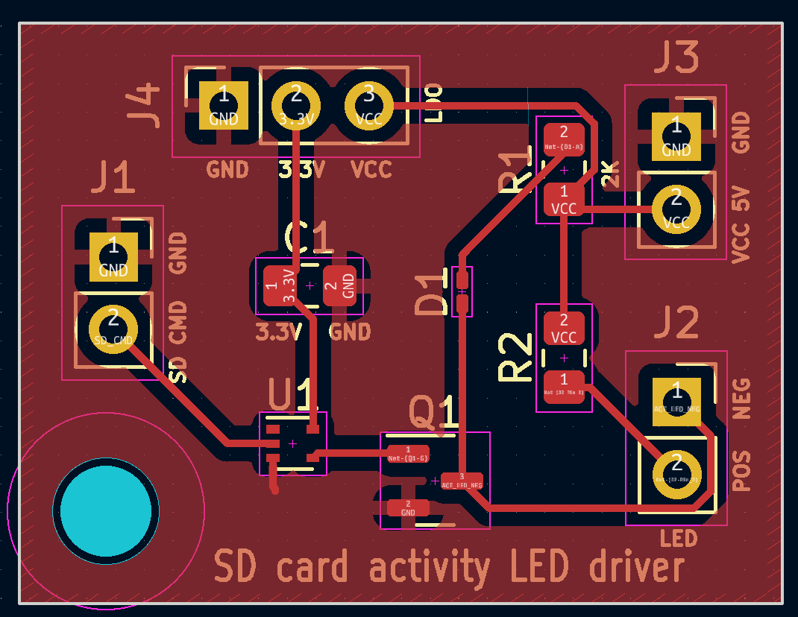

# SD-Card-Activity-LED-Driver
Switches on and off an LED based on SD Card activity

Components

- C1:	0.1uF	 SMD 0805
- D1:	LED	SMD 0201
- Q1: [BSS138](https://www.onsemi.com/pub/Collateral/BSS138-D.PDF)
- R1:	2K	SMD 0805
- R2:	330	SMD 0805
- U1:	[74LVC1G04](https://www.ti.com/product/SN74LVC1G04)
- Conn_LDO: AMS1117-3.3V Buck Module LDO

